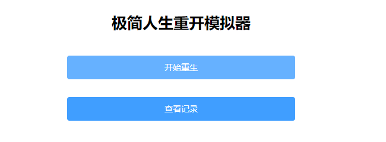
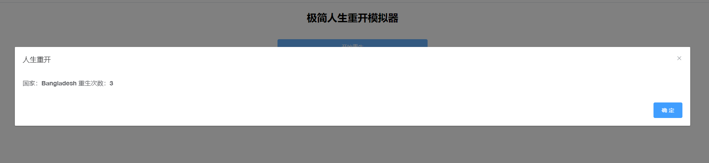
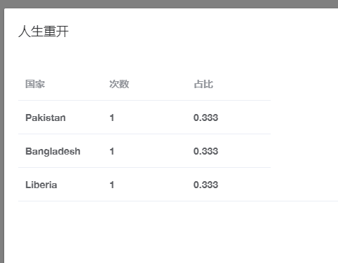

# Remake Web
无事写的remake web

曾部署到服务器上 现服务器已过期
# 开发环境
- jdk 8
- IntelliJ IDEA 
- maven
- redis
- springboot
- sa-token
# 项目地址

# 项目演示

# 使用方法

分别下载前后端项目文件

在前端的终端输入`npm install`安装依赖，然后输入`npm run dev`运行

在后端打开redis服务，直接运行springboot程序。
